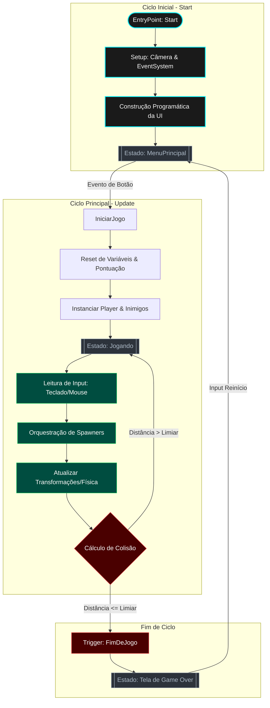

# 🎮 NEON SOBREVIVÊNCIA

## 📝 Descrição

Projeto desenvolvido em **Unity (C#)** que implementa um jogo 2D de sobrevivência com geração procedural de entidades, controle em tempo real via **Unity Input System** e interface construída integralmente por código.

O núcleo do sistema está concentrado na classe `MotorDoJogo`, responsável por orquestrar o ciclo de vida da aplicação, gerenciamento de estados, entrada do usuário, renderização básica e lógica de jogo.

---

## 🏗️ Arquitetura

O projeto segue uma estrutura monolítica orientada a um controlador central:

### `MotorDoJogo.cs` ⚙️

Responsabilidades principais:

* 🔹 Gerenciamento de estados (`MenuPrincipal`, `Jogando`, `FimDeJogo`)
* 🔹 Criação dinâmica da UI (`Canvas`, `Text`, `Button`)
* 🔹 Controle de input via `Keyboard` e `Mouse` (Input System)
* 🔹 Spawn e atualização de entidades (`GameObject`)
* 🔹 Sistema de colisão baseado em distância (`Vector3.Distance`)
* 🔹 Sistema de partículas procedural
* 🔹 Feedback visual (TrailRenderer, camera shake)
* 🔹 Controle de pontuação e progressão de dificuldade

---

## 🔄 Fluxo de Execução


---

## 🛠️ Principais Componentes Técnicos

### ⌨️ Entrada de Dados
* **Sistema:** Utilização do pacote `UnityEngine.InputSystem`.
* **Leitura:** Acesso direto aos dispositivos via `Keyboard.current` e `Mouse.current`.
* **Arquitetura:** Separação clara entre o input de movimento e ações de disparo.

### 📦 Sistema de Entidades
* **Instanciação:** Gerenciamento dinâmico via `new GameObject()`.
* **Gerenciamento:** Armazenamento centralizado em listas (`List<GameObject>`).
* **Ciclo de Vida:** Atualização manual por frame através do método `Update()`, garantindo controle total sobre a execução.

### 🖼️ Renderização
* **Sprites:** Uso de `SpriteRenderer` com texturas geradas proceduralmente via `Texture2D`.
* **Feedback:** Implementação de `TrailRenderer` para rastro visual dos objetos.

### 🖥️ UI (Interface do Usuário)
Construção feita de forma programática, sem dependência excessiva do Inspector:
* **Estrutura:** `Canvas`, `CanvasScaler` e `GraphicRaycaster`.
* **Texto:** Gerenciamento de fontes via `Resources`.
* **Interação:** `Button` utilizando `UnityAction`.

### ⚛️ Física e Colisão
* **Modelo:** Sistema simplificado baseado em **distância euclidiana**.
* **Otimização:** Não utiliza `Collider` ou `Rigidbody` nativos, reduzindo o overhead do motor de física para cálculos manuais de alta performance.

### 🎆 Efeitos Visuais
* **Partículas:** Sistema customizado gerado via múltiplos `GameObject`.
* **Dinâmica:** Decaimento de *alpha* (transparência) e escala ao longo do tempo.
* **Polimento:** Efeito de *Camera Shake* (tremor de câmera) implementado via deslocamento aleatório de coordenadas.

### 📈 Progressão de Dificuldade
* **Escalabilidade:** Redução progressiva do intervalo de spawn (`taxaDeGeracao`).
* **Controle:** Definição de limites mínimos para manter a jogabilidade balanceada.

---

## 🚀 Como Executar

Para rodar o projeto localmente, siga os passos abaixo:

1.  **Clonar o repositório:**
    ```bash
    git clone [https://github.com/marciomateus152/Jogo_Bolinha_Unity.git](https://github.com/marciomateus152/Jogo_Bolinha_Unity.git)
    ```
2.  **Abrir no Unity:**
    * Abra o **Unity Hub**.
    * Clique em `Add` e selecione a pasta do projeto clonado.
    * Certifique-se de usar a versão do Unity recomendada.
3.  **Rodar o Jogo:**
    * Abra a cena principal (`MainScene` ou similar) e clique no botão **Play**.

---

## 💡 Considerações de Design

O projeto foi construído com os seguintes pilares:

* ✅ **Baixo acoplamento externo:** Mínima dependência de assets da Asset Store.
* ✅ **Geração procedural:** Elementos visuais criados via código.
* ✅ **Ciclo de atualização explícito:** Menos dependência do "Magic Methods" ocultos da Unity.
* ✅ **Estrutura simples:** Ideal para prototipação rápida e fácil expansão de funcionalidades.
